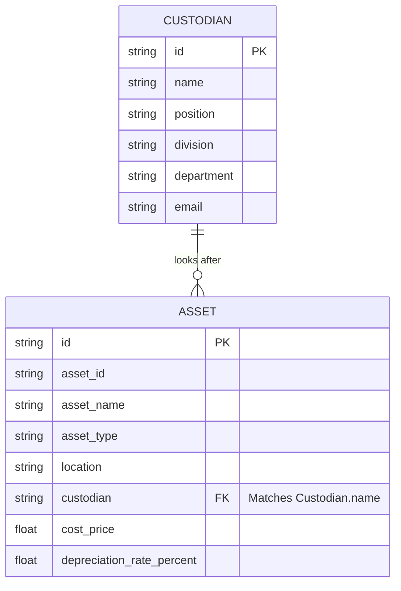

# เอกสารอธิบายโครงสร้างข้อมูล ชนิดของข้อมูล ความสัมพันธ์ และตัวอย่าง (Data Specification)

เอกสารฉบับนี้อธิบายรายละเอียดเกี่ยวกับโมเดลข้อมูล (Data Model) ชนิดของข้อมูล (Data Types) ความสัมพันธ์ (Relationships) และการคำนวณค่าเสื่อมราคาที่ใช้ในระบบจัดการครุภัณฑ์และสินทรัพย์ (Inventory Management System) ของแอปพลิเคชันนี้

---

## 1. โครงสร้างข้อมูลหลัก (Data Entities & Fields)

ระบบประกอบด้วยโครงสร้างข้อมูลหลัก 2 ส่วน ได้แก่ **ครุภัณฑ์ (Asset)** และ **ผู้ดูแลรับผิดชอบ (Custodian)** รวมถึงข้อมูลการตั้งค่าอื่น ๆ ที่ถูกจัดเก็บและเรียกใช้งานผ่าน LocalStorage

### 1.1 ข้อมูลครุภัณฑ์ (Asset)
เป็นข้อมูลที่ใช้จัดเก็บรายละเอียดของครุภัณฑ์แต่ละชิ้น โดยจำแนกออกเป็นกลุ่มข้อมูลย่อยดังนี้:

| กลุ่มข้อมูล | ชื่อฟิลด์ | ชนิดข้อมูล (Data Type) | คำอธิบาย |
| :--- | :--- | :--- | :--- |
| **ระดับบนสุด** | `id` | `String` | รหัสอ้างอิงภายในระบบ (Generated ID เช่น `asset-1718528990000-0`) |
| **ข้อมูลทั่วไป (general_info)** | `asset_name` | `String` | ชื่อของครุภัณฑ์ (เช่น "เครื่องคอมพิวเตอร์พกพา") |
| | `asset_type` | `String` | ประเภทครุภัณฑ์ (เช่น "ครุภัณฑ์คอมพิวเตอร์", "ครุภัณฑ์สำนักงาน") |
| | `brand` | `String` | ยี่ห้อของครุภัณฑ์ |
| | `model` | `String` | รุ่นของครุภัณฑ์ |
| | `description`| `String` | คำอธิบายคุณลักษณะเฉพาะเพิ่มเติม |
| **ที่มาและมูลค่า (source_and_value)** | `acquisition_date` | `String` (Format: `YYYY-MM-DD`) | วันที่ได้มา/จัดซื้อ |
| | `procurement_method` | `String` | วิธีการจัดซื้อจัดจ้าง (เช่น "วิธีเฉพาะเจาะจง", "e-bidding") |
| | `cost_price` | `Number` (Decimal) | ราคาทุน/ราคาซื้อ (เช่น `32000.00`) |
| | `receipt_number` | `String` | เลขที่ใบเสร็จรับเงิน/ใบกำกับภาษี |
| **การใช้งานและผู้รับผิดชอบ (usage)** | `asset_id` | `String` | รหัสครุภัณฑ์ทางราชการ/สติกเกอร์ (เช่น `คร.67/2024/001`) |
| | `location` | `String` | สถานที่จัดตั้ง/ใช้งาน (เช่น "ห้องทำงานเทคโนโลยีสารสนเทศ") |
| | `custodian` | `String` | ชื่อผู้ดูแลรับผิดชอบ (อ้างอิงชื่อจากผู้ดูแลในระบบ) |
| | `status` | `String` | สถานะของครุภัณฑ์ (`ใช้งาน`, `ชำรุด`, `รอจำหน่าย`, `จำหน่ายแล้ว`) |
| **สถานะทางการเงิน (financial_status)** | `depreciation_rate_percent` | `Number` (Float) | อัตราค่าเสื่อมราคาต่อปี (เช่น `20.00` สำหรับ 20%) |
| | `accumulated_depreciation` | `Number` (Float) | *ค่าที่คำนวณได้*: ค่าเสื่อมราคาสะสมจนถึงปัจจุบัน |
| | `book_value` | `Number` (Float) | *ค่าที่คำนวณได้*: มูลค่าคงเหลือสุทธิ (Book Value) |

---

### 1.2 ข้อมูลผู้ดูแลรับผิดชอบ (Custodian)
โครงสร้างข้อมูลของผู้ดูแลรับผิดชอบครุภัณฑ์ในสำนักงาน:

| ชื่อฟิลด์ | ชนิดข้อมูล (Data Type) | คำอธิบาย |
| :--- | :--- | :--- |
| `id` | `String` | รหัสประจำตัวผู้ดูแลในระบบ (เช่น `cust-1`) |
| `name` | `String` | ชื่อ-นามสกุลของผู้ดูแล (เช่น `นายสมชาย ใจดี`) |
| `position` | `String` | ตำแหน่งงาน (เช่น `นักวิเคราะห์ระบบ`) |
| `division` | `String` | กอง/สำนัก (เช่น `กองสาธารณสุขและสิ่งแวดล้อม`) |
| `department` | `String` | ฝ่าย/งาน (เช่น `ฝ่ายพัฒนาระบบ`) |
| `email` | `String` | อีเมลสำหรับการติดต่อ |

---

### 1.3 ข้อมูลการตั้งค่าพื้นฐาน (Configuration Lists)
ข้อมูลแวดล้อมที่เป็นตัวเลือกให้ผู้ใช้เลือกในฟอร์มเพื่อรักษามาตรฐานความถูกต้องของข้อมูล (Data Integrity):
- **หน่วยงาน/กอง (Divisions):** `Array of Strings` (ตัวอย่าง: `["กองสาธารณสุขและสิ่งแวดล้อม", "สำนักปลัด", "กองคลัง"]`)
- **ฝ่าย/แผนก (Departments):** `Array of Strings` (ตัวอย่าง: `["ฝ่ายพัฒนาระบบ", "ฝ่ายธุรการทั่วไป", "ฝ่ายการเงินและบัญชี"]`)
- **ตำแหน่ง (Positions):** `Array of Strings` (ตัวอย่าง: `["นักวิชาการคอมพิวเตอร์", "เจ้าพนักงานธุรการ", "นักวิเคราะห์ระบบ"]`)
- **ยี่ห้อ (Brands):** `Array of Strings` (ตัวอย่าง: `["Dell", "HP", "Daikin", "Toyota", "Modernform"]`)
- **สถานที่ติดตั้ง (Locations):** `Array of Strings` (ตัวอย่าง: `["ห้องธุรการทั่วไป", "ห้องทำงานเทคโนโลยีสารสนเทศ", "โรงจอดรถยนต์กลาง"]`)

---

## 2. ความสัมพันธ์ของข้อมูล (Data Relationships)

ความสัมพันธ์ระหว่างข้อมูลในระบบนี้เป็นลักษณะของเชิงสัมพันธ์แบบอ่อน (Soft Relationship) ผ่านการจับคู่อักษร (String matching) หรือ ID:



### คำอธิบายความสัมพันธ์:
1. **Custodian กับ Asset (แบบ One-to-Many / 1:N):**
   - ผู้ดูแลรับผิดชอบ 1 คน (`Custodian`) สามารถดูแลครุภัณฑ์ได้หลายชิ้น (`Asset`)
   - ครุภัณฑ์ 1 ชิ้น จะมีผู้ดูแลรับผิดชอบเพียงคนเดียวผ่านทางฟิลด์ `usage.custodian` ที่เก็บชื่อตรงกันกับ `Custodian.name`
2. **ขอบเขตค่าข้อมูล (Enums / System Settings):**
   - ฟิลด์ `general_info.brand` เชื่อมโยงกับรายชื่อยี่ห้อที่ระบบอนุญาต
   - ฟิลด์ `usage.location` เชื่อมโยงกับสถานที่ติดตั้งทั้งหมดในระบบ
   - ฟิลด์ `Custodian.division`, `Custodian.department` และ `Custodian.position` เชื่อมโยงกับโครงสร้างสายงานขององค์กร

---

## 3. การคำนวณค่าเสื่อมราคา (Depreciation Calculation Logic)

ระบบมีฟังก์ชันคำนวณค่าเสื่อมราคาแบบเส้นตรง (Straight-Line Depreciation) โดยมีวิธีคิดคำนวณตามมาตรฐานการบัญชีภาครัฐของไทย:

### 3.1 สูตรการคำนวณหลัก
1. **หาจำนวนวันการใช้งานรวม (Total Usage Days):**
   $$\text{Days} = \text{Target Date} - \text{Acquisition Date}$$
2. **หาค่าเสื่อมราคาต่อปี (Annual Depreciation):**
   $$\text{Annual Depreciation} = \text{Cost Price} \times \left( \frac{\text{Depreciation Rate \%}}{100} \right)$$
3. **หาค่าเสื่อมราคาต่อวัน (Daily Depreciation):** (เทียบเคียง 365 วันต่อปี)
   $$\text{Daily Depreciation} = \frac{\text{Annual Depreciation}}{365}$$
4. **ค่าเสื่อมราคาสะสม (Accumulated Depreciation):**
   $$\text{Accumulated Depreciation} = \text{Daily Depreciation} \times \text{Days}$$

### 3.2 กฎการคำนวณขั้นต่ำทางบัญชี (Minimum Salvage Value Rule)
> [!IMPORTANT]
> ตามหลักเกณฑ์การหักค่าเสื่อมราคาและค่าตัดจำหน่ายของสินทรัพย์ถาวร **มูลค่าคงเหลือสุทธิ (Book Value) ของสินทรัพย์จะลดลงต่ำกว่า 1 บาทไม่ได้** (ต้องเหลือมูลค่าซากไว้ 1 บาทเพื่อเป็นหลักฐานในทะเบียนทรัพย์สินจนกว่าจะจำหน่ายออก)
> ดังนั้น สูตรคำนวณขั้นสุดท้ายคือ:
> - $\text{Max Depreciation} = \text{Cost Price} - 1$
> - หากค่าเสื่อมสะสมคำนวณได้สูงกว่า $\text{Max Depreciation}$ ระบบจะตั้งค่าเสื่อมราคาสะสมไว้ที่ $\text{Max Depreciation}$ และทำให้ $\text{Book Value} = 1.00$ บาทเสมอ

---

## 4. ตัวอย่างข้อมูล (JSON Examples)

### 4.1 ตัวอย่างข้อมูลครุภัณฑ์ (Asset Entity JSON)
```json
{
  "id": "asset-1718528990000-0",
  "general_info": {
    "asset_name": "เครื่องคอมพิวเตอร์พกพา (Notebook)",
    "asset_type": "ครุภัณฑ์คอมพิวเตอร์",
    "brand": "Dell",
    "model": "Latitude 5440",
    "description": "จอแสดงผล 14 นิ้ว, CPU Core i5, RAM 16GB, SSD 512GB สำหรับใช้งานวิเคราะห์ระบบ"
  },
  "source_and_value": {
    "acquisition_date": "2024-03-15",
    "procurement_method": "วิธีเฉพาะเจาะจง",
    "cost_price": 32000.00,
    "receipt_number": "REC-670315"
  },
  "usage": {
    "asset_id": "คร.67/2024/001",
    "location": "ห้องทำงานเทคโนโลยีสารสนเทศ",
    "custodian": "นายสมชาย ใจดี",
    "status": "ใช้งาน"
  },
  "financial_status": {
    "depreciation_rate_percent": 20.00,
    "accumulated_depreciation": 14382.47,
    "book_value": 17617.53
  }
}
```

### 4.2 ตัวอย่างข้อมูลผู้ดูแลรับผิดชอบ (Custodian Entity JSON)
```json
{
  "id": "cust-1",
  "name": "นายสมชาย ใจดี",
  "position": "นักวิเคราะห์ระบบ",
  "division": "กองสาธารณสุขและสิ่งแวดล้อม",
  "department": "ฝ่ายพัฒนาระบบ",
  "email": "somchai.j@office.go.th"
}
```
