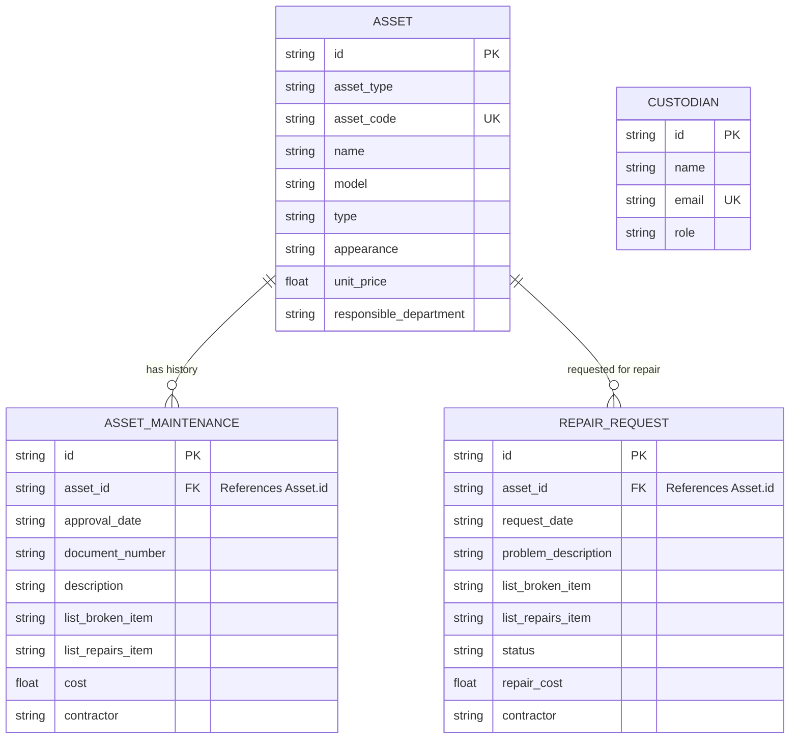

# เอกสารอธิบายโครงสร้างข้อมูล ชนิดของข้อมูล ความสัมพันธ์ และตัวอย่าง (Data Specification)

เอกสารฉบับนี้อธิบายรายละเอียดเกี่ยวกับโมเดลข้อมูล (Data Model) ชนิดของข้อมูล (Data Types) ความสัมพันธ์ (Relationships) และการคำนวณค่าเสื่อมราคาที่ใช้ในระบบจัดการครุภัณฑ์และสินทรัพย์ (Inventory Management System) ของแอปพลิเคชันนี้ โดยปรับโครงสร้างตามตารางฐานข้อมูลหลัก (Flat Table Structure) ของแบบทะเบียน พ.ด.1 และ พ.ด.2 รวมถึงส่วนของการแจ้งซ่อมและประวัติผู้ดูแลรับผิดชอบ

---

## 1. โครงสร้างข้อมูลหลัก (Data Entities & Fields)

ระบบประกอบด้วยโครงสร้างข้อมูลหลัก 5 ส่วน ได้แก่ **ทะเบียนทรัพย์สินและพัสดุ (Assets)**, **ประวัติการซ่อมบำรุงรักษา (Asset Maintenances)**, **ผู้ดูแลรับผิดชอบ (Custodian)**, **คำขอส่งซ่อม (Repair Requests)** และ **บันทึกกิจกรรมระบบ (Audit Logs)**

### 1.1 ข้อมูลทรัพย์สิน/พัสดุ (Assets)
เป็นข้อมูลที่ใช้ควบคุมทะเบียนพัสดุ พ.ด.1 และ พ.ด.2 ในรูปแบบตารางเดียว (Flat Structure):

| ชื่อฟิลด์ (Field Name) | ชนิดข้อมูล (Data Type) | ข้อกำหนด (Constraints) | คำอธิบาย (Description) |
| :--- | :--- | :--- | :--- |
| `id` | `String` | Primary Key | รหัสอ้างอิงภายในระบบ (เช่น `asset-1718528990000-0`) |
| `asset_type` | `String` (Enum) | `'LAND_BUILDING'` \| `'EQUIPMENT'` | ประเภทสมุดทะเบียนหลัก (`'LAND_BUILDING'` สำหรับ พ.ด.1, `'EQUIPMENT'` สำหรับ พ.ด.2) |
| `category` | `String` | Required | หมวดหมู่ย่อยของพัสดุ (เช่น "ครุภัณฑ์สำนักงาน", "ครุภัณฑ์คอมพิวเตอร์") |
| `asset_code` | `String` (9 หลัก) | Unique, Format: `XXX/YY/ZZZZ` | Required | รหัสคุมพัสดุราชการ (กลุ่ม1: รหัสประเภท, กลุ่ม2: ปี พ.ศ. ที่ได้มา, กลุ่ม3: ลำดับพัสดุ) |
| `name` | `String` | Required | ชื่อพัสดุ/ทรัพย์สิน (เช่น "เครื่องปรับอากาศ 18000 BTU") |
| `location` | `String` | | สถานที่ตั้งพัสดุ (เช่น "ห้องธุรการทั่วไป") |
| `acquisition_method` | `String` (Enum) | `'ซื้อ'` \| `'จ้าง'` \| `'รับโอน'` \| `'บริจาค'` | ลักษณะการได้กรรมสิทธิ์พัสดุ |
| `delivery_document_no` | `String` | | เลขที่ของใบส่งของหรือหนังสืออนุมัติ/สัญญาจัดหา (เช่น "นบ 0023/154", "PO-670315") |
| `delivery_document_date` | `String` (Format: `YYYY-MM-DD`) | | วันเดือนปีที่ระบุในใบส่งของหรือหนังสืออนุมัติ/สัญญาจัดหา (เช่น "2021-03-12") |
| `seller_name` | `String` | | ชื่อผู้ขายหรือคู่สัญญาจัดหา (เลือกจากที่ตั้งค่าในระบบ เช่น "บจก. เอสเอสพี คอมพิวเตอร์") |
| `unit_price` | `Number` (Float) | Min: 0 | ราคาทุนต่อหน่วย (บาท) |
| `budget_owner` | `String` | Optional | ชื่อเจ้าของงบประมาณ (เช่น "เงินงบประมาณประจำปี 2568") |
| `responsible_department` | `String` | | ชื่อส่วนราชการหรือฝ่ายที่ดูแลรับผิดชอบ (เช่น "กองช่าง", "ฝ่ายธุรการทั่วไป") |
| `status` | `String` (Enum) | `'ใช้งาน'` \| `'ชำรุด'` \| `'กำลังซ่อม'` \| `'รอจำหน่าย'` \| `'จำหน่ายแล้ว'` | สถานะทางกายภาพของพัสดุ |
| `model` | `String` | Optional | แบบ (เช่น "Latitude 5420") |
| `type` | `String` | Optional | ชนิด (เช่น "Notebook") |
| `appearance` | `String` | Optional | ลักษณะ (เช่น "ตัวเครื่องสีเทา จอ 14 นิ้ว") |
| `photo` | `String` (Longtext) | Optional | รูปภาพครุภัณฑ์ (บันทึกในรูปแบบ Base64) |

#### ฟิลด์เฉพาะแบบ พ.ด.1 (ที่ดินและสิ่งก่อสร้าง - `asset_type: 'LAND_BUILDING'`)
| ชื่อฟิลด์ | ชนิดข้อมูล | คำอธิบาย |
| :--- | :--- | :--- |
| `document_of_title` | `String` | ชนิดและเลขที่เอกสารสิทธิ์ (เช่น "โฉนดที่ดินเลขที่ 12456") |
| `area_size` | `String` | ขนาดเนื้อที่ตามโฉนด (เช่น "2 ไร่ 1 งาน 50 ตารางวา") |
| `building_style` | `String` | ลักษณะทางโครงสร้างโรงเรือนและชั้น (เช่น "ตึกคอนกรีต 2 ชั้น") |

#### ฟิลด์เฉพาะแบบ พ.ด.2 (ครุภัณฑ์ ยานพาหนะ และสัตว์พาหนะ - `asset_type: 'EQUIPMENT'`)
| ชื่อฟิลด์ | ชนิดข้อมูล | คำอธิบาย |
| :--- | :--- | :--- |
| `manufacturer_brand` | `String` | ชื่อผู้ผลิตหรือเครื่องหมายการค้า (ยี่ห้อ เช่น "Dell", "Toyota") |
| `serial_number` | `String` | หมายเลขประจำพัสดุจากโรงงาน (Serial Number) |
| `engine_number` | `String` | หมายเลขเครื่องยนต์ (สำหรับยานพาหนะ) |
| `chassis_number` | `String` | หมายเลขตัวถัง/เลขแคสซี (Chassis Number) |
| `vehicle_registration` | `String` | หมายเลขทะเบียนยานพาหนะ (เช่น "กข-5642 นนทบุรี") |
| `color` | `String` | สีพัสดุ (เช่น "สีบรอนซ์เงิน") |
| `warranty_start_date` | `String` (Format: `YYYY-MM-DD`) | วันที่เริ่มรับประกันครุภัณฑ์ |
| `warranty_end_date` | `String` (Format: `YYYY-MM-DD`) | วันที่สิ้นสุดการรับประกันครุภัณฑ์ |
| `warranty_company` | `String` | ชื่อบริษัทหรือคู่สัญญาที่รับประกันพัสดุ (เลือกจากที่ตั้งค่าในระบบ) |

---

### 1.2 ข้อมูลประวัติการซ่อมบำรุงรักษา (Asset Maintenances)
ข้อมูลที่ใช้บันทึกประวัติการปรับปรุงหรือซ่อมแซมครุภัณฑ์และสิ่งก่อสร้าง (พิมพ์แสดงผลใน หน้า 2 ของ พ.ด.1 และ พ.ด.2):

| ชื่อฟิลด์ | ชนิดข้อมูล | ข้อกำหนด | คำอธิบาย |
| :--- | :--- | :--- | :--- |
| `id` | `String` | Primary Key | รหัสรายการซ่อมแซม (เช่น `maint-1718528990000`) |
| `asset_id` | `String` | Foreign Key | เชื่อมโยงไปยังฟิลด์ `id` ในตาราง `assets` |
| `approval_date` | `Date` (String) | Required | วันเดือนปีที่ได้รับอนุมัติให้ซ่อมบำรุง (Format: `YYYY-MM-DD`) |
| `document_number` | `String` | Required | เลขที่หนังสืออนุมัติ (เช่น "นบ 5420X/XXXX") |
| `description` | `String` | Optional (NULL) | คำอธิบายการดำเนินการซ่อมแซม (ใช้สำหรับความเข้ากันได้ย้อนหลัง) |
| `list_broken_item` | `String` | Optional | รายการชิ้นส่วนที่ชำรุดเสียหาย (listBrokenitem) เช่น "หน้าจอร้าว, แผงบอร์ดไหม้" |
| `list_repairs_item` | `String` | Optional | รายการเปลี่ยนอะไหล่โดยละเอียด (listrepairsitem) เช่น "เปลี่ยนจอ LCD, เปลี่ยนตัวต้านทาน R15" |
| `cost` | `Number` (Float) | Min: 0 | จำนวนเงินค่าซ่อมแซมบำรุงรักษา (บาท) |
| `contractor` | `String` | Optional | ชื่อบุคคลหรือบริษัทผู้รับจ้างดำเนินการซ่อมแซม |

---

### 1.3 ข้อมูลผู้ดูแลรับผิดชอบ (Custodian)
โครงสร้างข้อมูลบุคลากรผู้ดูแลและรับผิดชอบพัสดุในองค์กร รวมถึงผู้ใช้งานระบบ:

| ชื่อฟิลด์ | ชนิดข้อมูล | คำอธิบาย |
| :--- | :--- | :--- |
| `id` | `String` | รหัสผู้ดูแล (เช่น `cust-1`) |
| `name` | `String` | ชื่อ-สกุลผู้ดูแล (เช่น `นายสมชาย ใจดี`) |
| `position` | `String` | ตำแหน่งงานทางราชการ (เช่น `นักวิเคราะห์ระบบ`) |
| `division` | `String` | กอง/สำนัก (เช่น `กองคลัง`) |
| `department` | `String` | ฝ่าย/งาน (เช่น `ฝ่ายการเงินและบัญชี`) |
| `email` | `String` | อีเมลในการติดต่อทางระบบ (ใช้ระบุตัวตนในการล็อกอินผ่านระบบกลาง SSO) |
| `role` | `String` (Enum) | สิทธิ์การใช้งานระบบ (`'CUSTODIAN'` สิทธิ์เจ้าหน้าที่/ผู้ดูแลทั่วไป \| `'TECHNICIAN'` สิทธิ์ช่างเทคนิคซ่อมบำรุง) |

---

### 1.4 ข้อมูลคำขอส่งซ่อม (Repair Requests)
เก็บประวัติรายการขอแจ้งซ่อมที่พนักงานหรือช่างส่งเข้ามาในระบบ:

| ชื่อฟิลด์ | ชนิดข้อมูล | ข้อกำหนด | คำอธิบาย |
| :--- | :--- | :--- | :--- |
| `id` | `String` | Primary Key | รหัสใบคำขอส่งซ่อม (เช่น `repair-1718528990000-123`) |
| `asset_id` | `String` | Foreign Key | เชื่อมโยงไปยังฟิลด์ `id` ในตาราง `assets` |
| `request_date` | `String` | Required | วันและเวลาที่ยื่นคำขอส่งซ่อม (ISO String format) |
| `problem_description` | `String` | Required | อาการชำรุดเสียหายที่ระบุโดยละเอียดเบื้องต้น |
| `list_broken_item` | `String` | Required | รายการชำรุดเสียหาย/ชิ้นส่วนบกพร่อง (ป้อนตอนแจ้งซ่อมและพิมพ์ในใบอนุมัติซ่อม) |
| `list_repairs_item` | `String` | Optional | รายละเอียดการเปลี่ยนอะไหล่/ซ่อมจริง (ช่างระบุตอนบันทึกซ่อมเสร็จ) |
| `status` | `String` (Enum) | `'PENDING'` \| `'IN_PROGRESS'` \| `'COMPLETED'` \| `'REJECTED'` | สถานะของคำขอส่งซ่อม |
| `rejection_reason` | `String` | Optional | เหตุผลในกรณีที่คำขอส่งซ่อมถูกยกเลิก (Rejected) |
| `repair_cost` | `Number` (Float) | Min: 0 | ค่าใช้จ่ายการซ่อมแซมจริง (บาท) |
| `contractor` | `String` | Optional | บริษัทหรือคู่สัญญาผู้จ้างซ่อมบำรุง |
| `approval_date` | `String` | Optional | วันที่ลงในหนังสือหนังสืออนุมัติซ่อม (Format: `YYYY-MM-DD`) |
| `document_number` | `String` | Optional | เลขที่หนังสืออนุมัติจัดจ้างซ่อมแซม |
| `officer_notes` | `String` | Optional | บันทึกช่วยจำหรือหมายเหตุของเจ้าหน้าที่/ช่าง |

---

### 1.5 บันทึกประวัติกิจกรรมระบบ (Audit Logs)
ประวัติการทำกิจกรรมสำคัญบนระบบเพื่อความโปร่งใสตรวจสอบได้:

| ชื่อฟิลด์ | ชนิดข้อมูล | คำอธิบาย |
| :--- | :--- | :--- |
| `id` | `String` | รหัสบันทึก (เช่น `log-1718528990000`) |
| `timestamp` | `String` | วันและเวลาที่เกิดกิจกรรม (ISO Format) |
| `action` | `String` | ประเภทกิจกรรม (เช่น `แจ้งซ่อม`, `แก้ไขพัสดุ`, `เปลี่ยนรหัสผ่าน`) |
| `details` | `String` | รายละเอียดเนื้อหาของกิจกรรมที่เปลี่ยนแปลง |
| `user` | `String` | ชื่อผู้ใช้ระบบที่เป็นคนสั่งการทำรายการ |

---

## 2. ความสัมพันธ์ของข้อมูล (Data Relationships)

ความสัมพันธ์จำลองของโมเดลข้อมูลพัสดุ ประวัติการซ่อมบำรุง และสิทธิ์ระบบ:



---

## 3. การคำนวณค่าเสื่อมราคา (Depreciation Calculation Logic)

ระบบมีการคำนวณค่าเสื่อมราคาประจำปีและค่าเสื่อมสะสมแบบเส้นตรง (Straight-Line Depreciation) อัตโนมัติ:

### 3.1 การถอดปีจัดหาและอัตราค่าเสื่อม
1. **ปีที่ได้มา (Acquisition Year):** ดึงข้อมูลจากส่วนที่ 2 (กลาง) ของรหัสพัสดุ (`asset_code` เช่น `412/67/0001` -> ปี พ.ศ. 2567 -> เทียบเท่ากับวันที่ 1 มกราคม ค.ศ. 2024 ทางบัญชี)
2. **การหาอัตราค่าเสื่อมราคา (Annual Depreciation Rate %):** อ้างอิงตามรหัสประเภทพัสดุ 3 หลักแรกของ `asset_code` ดังนี้:
   - รหัส `101` (ที่ดิน): อัตรา **0%** ต่อปี (ไม่มีการหักค่าเสื่อมราคา)
   - รหัส `102`, `103` (อาคาร/สิ่งปลูกสร้าง): อัตรา **5%** ต่อปี (คิดอายุการใช้งาน 20 ปี)
   - รหัส `412` (คอมพิวเตอร์): อัตรา **20%** ต่อปี (คิดอายุการใช้งาน 5 ปี)
   - รหัส `312` (ยานพาหนะ): อัตรา **20%** ต่อปี (คิดอายุการใช้งาน 5 ปี)
   - รหัส `313` (ไฟฟ้าและวิทยุ): อัตรา **20%** ต่อปี (คิดอายุการใช้งาน 5 ปี)
   - รหัสอื่น ๆ นอกเหนือจากนี้: อัตราเริ่มต้น **10%** ต่อปี (คิดอายุการใช้งาน 10 ปี)

### 3.2 สูตรการคำนวณสะสมตามวัน
- หาจำนวนวันการใช้งานสะสม:
  $$\text{Days} = \text{Target Date} - \text{1 Jan of Acquisition Year}$$
- คำนวณค่าเสื่อมสะสม:
  $$\text{Accumulated Depreciation} = \left( \frac{\text{Unit Price} \times \text{Rate \%}}{100 \times 365} \right) \times \text{Days}$$
- บัญชีท้องถิ่นกำหนดให้รักษามูลค่าซากขั้นต่ำไว้อย่างน้อย **1.00 บาท**
  $$\text{Max Depreciation} = \text{Unit Price} - 1.00$$
  $$\text{Book Value} = \text{Unit Price} - \text{Accumulated Depreciation (ไม่เกิน Max)}$$

---

## 4. ตัวอย่างข้อมูล (JSON Example)

### ตัวอย่างข้อมูลในตารางคุมพัสดุ (พ.ด.2) ที่มีประวัติซ่อมบำรุง
```json
{
  "id": "asset-1718528990000-0",
  "asset_type": "EQUIPMENT",
  "asset_code": "312/64/0001",
  "name": "รถยนต์อเนกประสงค์ (SUV) 2,400 ซีซี",
  "location": "โรงจอดรถยนต์กลาง",
  "acquisition_method": "ซื้อ",
  "delivery_document_no": "e-bidding 12/2564",
  "delivery_document_date": "2021-08-12",
  "seller_name": "บจก. ยานยนต์รุ่งเรือง",
  "unit_price": 1390000.00,
  "budget_owner": "งบลงทุนจัดหายานพาหนะ",
  "responsible_department": "ฝ่ายธุรการทั่วไป",
  "status": "ใช้งาน",
  "model": "Fortuner 2.4V",
  "type": "รถยนต์อเนกประสงค์",
  "appearance": "สีบรอนซ์เงิน ทะเบียน กข-5642",
  "photo": "data:image/jpeg;base64,...",
  "manufacturer_brand": "Toyota",
  "serial_number": "TOY-SUV-FT-6408",
  "engine_number": "2GD-FTV-124586",
  "chassis_number": "MR053K41208945",
  "vehicle_registration": "กข-5642 นนทบุรี",
  "color": "สีบรอนซ์เงิน",
  "warranty_start_date": "2021-08-12",
  "warranty_end_date": "2024-08-12",
  "warranty_company": "บจก. ยานยนต์รุ่งเรือง",
  "depreciation_rate_percent": 20.00,
  "accumulated_depreciation": 1334695.89,
  "book_value": 55304.11,
  "maintenances": [
    {
      "id": "maint-301",
      "approval_date": "2023-10-15",
      "document_number": "45/2566",
      "description": null,
      "list_broken_item": "ยางรถยนต์ชำรุดหมดสภาพ",
      "list_repairs_item": "เปลี่ยนยางรถยนต์ 4 เส้น และตรวจเช็คระยะรอบ 80,000 กม.",
      "cost": 28000.00,
      "contractor": "ศูนย์บริการโตโยต้านนทบุรี"
    }
  ]
}
```

---

## 5. การจำแนกประเภทพัสดุและรายงานราชการ (แบบ พ.ด.1, พ.ด.2 และ พ.ด.3)

ระบบรองรับการสร้างรายงานตามระเบียบพัสดุองค์กรปกครองส่วนท้องถิ่น โดยจำแนกตามประเภทและรหัสพัสดุดังนี้:

### 5.1 เกณฑ์การจัดกลุ่มทะเบียนพัสดุ

1. **ทะเบียนที่ดินและสิ่งก่อสร้าง (แบบ พ.ด.1):**
   - ใช้กับรายการทรัพย์สินที่อยู่ในกลุ่มประเภททะเบียนหลัก `asset_type: 'LAND_BUILDING'`
   - พิมพ์หน้า 1 (รายละเอียดทรัพย์สิน) และ หน้า 2 (ประวัติการซ่อมบำรุงรักษา) ในรูปแบบ A4 แนวนอน (Landscape) สีเขียว
2. **ทะเบียนครุภัณฑ์ ปศุสัตว์ และสัตว์พาหนะ (แบบ พ.ด.2):**
   - ใช้กับรายการทรัพย์สินที่อยู่ในกลุ่มประเภททะเบียนหลัก `asset_type: 'EQUIPMENT'`
   - พิมพ์หน้า 1 (รายละเอียดทรัพย์สินและคำนวณค่าเสื่อม) และ หน้า 2 (ประวัติการซ่อมบำรุงรักษา) ในรูปแบบ A4 แนวนอน (Landscape) สีเหลือง

### 5.2 บัญชีงบหน้าประจำเลขรหัสพัสดุ (แบบ พ.ด.3)

เป็นรายงานสรุปรวมมูลค่าทรัพย์สินตาม **รหัสประเภทพัสดุ 3 หลักแรก** (ตามรหัสบัญชีมาตรฐาน พ.ด.5 และ พ.ด.6) โดยระบบวิเคราะห์ตามกฎนี้:
- ดึงรหัส 3 ตัวแรกจากรหัสพัสดุ (`asset_code`) หากรหัสเริ่มต้นด้วยตัวเลข เช่น `311/68/0008` จะจัดกลุ่มเป็นรหัส `311` (ครุภัณฑ์สำนักงาน)
- จัดกลุ่มเพื่อออกตารางสรุป รวมจำนวนพัสดุ รวมราคาทุนรวม รวมค่าเสื่อมสะสม และมูลค่าคงเหลือสุทธิรวมในแต่ละประเภทรหัสพัสดุ

### 5.3 รูปแบบการจัดหน้าและพิมพ์ (A4 Landscape layout)
- หน้าจอบนเว็บแสดงผลแบบ Responsive แต่ออกแบบและสไตล์ผ่าน `@media print` ให้สั่งพิมพ์ทางกระดาษ A4 แนวนอน (Landscape) โดยอัตโนมัติ
- ซ่อนแถบเมนูด้านข้าง ตัวคัดกรอง และปุ่มกดจัดการต่างๆ ออกเมื่อกดสั่งพิมพ์ เพื่อให้เอกสารออกมาสะอาดถูกต้องตามรูปแบบของทางราชการ
